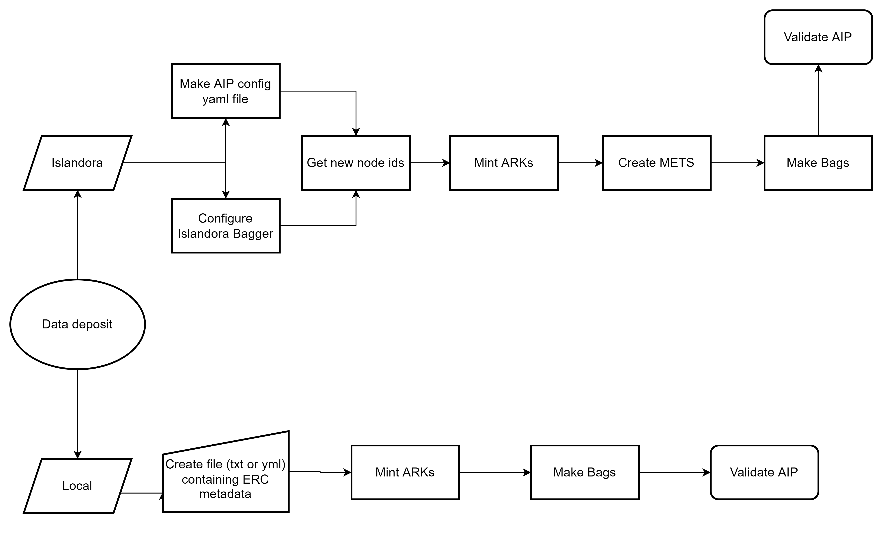

# AIP specification planning

This document is a draft specification for SFU Library's Archival Information Packages (AIPs).

Ongoing planning, issues, and other considerations are in [Planning notes](/planning_notes.md).

# 1. Introduction

The purpose of the AIP specification is to define what components and metadata are necessary and practical for long-term
preservation of digital objects at the SFU Library. The specification will provide guidelines and suggest workflows for
producing and validating AIPs in a platform-independent way.

# 2. AIP contents

AIPs should be structurally consistent to a degree. The `data` directory may include additional metadata other than
those specified here, but should not include derivatives such as OCR, thumbnails, or access copies.

## 2.1 BagIt files

The AIP will be contained within a Bag conforming to the [BagIt specification](https://www.ietf.org/rfc/rfc8493.txt).
The file directory will be as follows:

```
aip-575835bd-15b2-4ee6-b5ba-66db8c492d92
   ├── data
      ├── ObjectFileName
      └── metadata
         └── ObjectFileName_dmd.xml
   ├── bag-info.txt
   ├── bagit.txt
   ├── manifest-sha1.txt
   └── tagmanifest-sha1.txt
```
The name of the bag is `aip-` followed by the ARK identifier of the object (excluding shoulder). For Islandora objects, the identifier will be the same as the object's Drupal UUID.
The bag-info.txt, bagit.txt, and manifest files will be generated automatically when using bag generator tools.

The `bag-info.txt` file must include the `BagIt-Profile-Identifier` tag in order for it to be validated.

The data folder will contain the digital object and its metadata. The data directory will contain the object itself
saved in its original format with its original file name and a metadata subfolder. The metadata subfolder will contain,
at minimum, a file containing descriptive metadata, and a file containing technical metadata. 

## 2.2 Metadata

Descriptive metadata must be included in the AIP. Other metadata files not specified here (such as
platform-specific metadata exported directly from a repository) may be included if they would provide additional
contextual information.

Metadata files should be saved as either a plain text file (.txt) or an XML file.

Metadata files that are not part of the original object (e.g., files created automatically on transfer or by a librarian
as opposed to a README file connected to a research dataset) should be saved in the "metadata" subfolder within the data
directory.

Examples of different levels of metadata completeness are:

| Level         | Descriptive     | Technical    | Structural | Other     |
| :---          |    :----:       |    :---:     | :---:      |  ---:     |
| 0 (Minumum)   | DCMI Kernal/ERC | --           |       --   |    --     |
| 1 (Acceptable)| DCMI Kernal/ERC | Some extracted technical data|       --   |    --     |
| 2 (Acceptable)|  ERC plus non-standardized descriptive metadata    | FITS         | Platform-specific (e.g. node.json)|         |
| 3 (Preferred) |  Dublin Core    | FITS         |   METS     |  e.g. Additional repository-specific or preservation metadata|

The preferred level includes as much metadata as necessary to understand the object, its context of creation, related
objects, and its technical requirements. While not required, additional metadata may be included if it would provide
information that may be relevant to the object's preservation. If it is not possible to include more detailed
metadata, the minimum level is still compliant with this specification. ERC metadata is required to mint an ARK, and 
therefore cannot be excluded.

### Descriptive

[DCMI Kernal Metadata](https://www.dublincore.org/groups/kernel/spec/) should be included for minimum
descriptive information. At its most basic, the descriptive metadata will consist of the four required Kernal elements:

```
who: a responsible person or party (required)
what: a name or other human-oriented identifier (required)
when: a date important in the object's lifecycle (required)
where: a location or system-oriented identifier (required)
```

For locally stored objects, a yaml or text file containing the ERC elements must be stored alongside the object for an ARK to be minted. The file must be identified by following the naming convention: "ObjectFileName_erc.txt".

More in-depth descriptive metadata may be included. Descriptive metadata should follow a standardized schema
(preferably Dublin Core), but if it is not possible to do so, non-standardized metadata can be included as long as the
Kernal metadata elements are also present in the AIP.

Descriptive metadata files other than the minimum ERC metadata are identified in the AIP bag by "_dmd" appended to the filename.

### Technical

Technical metadata includes embedded information about the digital object, such as EXIF metadata for images or sample
rates for audio.

Technical information should be represented by [FITS metadata](https://projects.iq.harvard.edu/fits/home) when possible.

If the FITS tool cannot be used, technical information can be extracted from digital objects based on their format 
(audio, video, image, text, etc.). For a list of possible technical metadata elements, see the
[FITS metadata documentation.](https://projects.iq.harvard.edu/fits/fits-xml#metadata)

### Structural

Information about parent-child, hierarchical relationships between objects as well as arrangement for ordered content
should be captured when relevant. Ideally, the structural information will follow a recognized metadata standard such as
METS. When referencing an external object, use its persistent identifier (i.e., ARK) rather than a system- specific
identifier.

## 2.3 Taxonomies

Do not leave platform-specific taxonomy identifiers in the metadata without either translating them into terms or
providing a URI containing a definition.

Whenever possible, include either a URI pointing to taxonomy terms used (e.g. from [PCDM](https://pcdm.org/)), or define
them within the metadata.

# 3. Persistent Identifiers

AIPs will use [ARKs](https://arks.org/) as identifiers for objects. These should be used in place of platform-specific 
identifiers (such as Islandora node IDs) when representing object relationships and metadata. SFU will maintain 
separate ARK shoulders for objects hosted online and those that will only be stored locally.

ARKs will be minted and indexed using [larkm](https://github.com/mjordan/larkm).

# 4. Workflow



The AIP will be created as soon as possible after an object has been deposited.

1. Mint an ARK for each object using larkm. 
   * For Islandora repositories, use the Drupal UUID as the ARK identifier.
   * Specify the appropriate ARK shoulder for the object's storage location and retention period.
   * Include as many of the ERC metadata fields as possible.
2. The AIP creator will create a Bag from the digital object. This can either be created from the repository
   (i.e., with [Islandora bagger](https://github.com/mjordan/islandora_bagger)) or created from the object itself using
   a tool such as [Bagger](https://github.com/LibraryOfCongress/bagger)
   or [SFU Moveit](https://github.com/axfelix/moveit-electron).
    * Islandora Bagger can generate FITS and Dublin Core metadata files if specified in the configuration.
3. Confirm the Bag contains the expected contents and structure detailed in [2. AIP Contents](#2-aip-contents).
4. Verify that the `bag-info.txt` file includes a `BagIt-Profile-Identifier`. The `BagIt-Profile-Identifier` is the URI
   of the BagIt profile JSON file.

For more detailed workflow steps, see the [Islandora Workflow](/islandora_workflow.md) and 
[Local Objects Workflow](/local_workflow.md).
